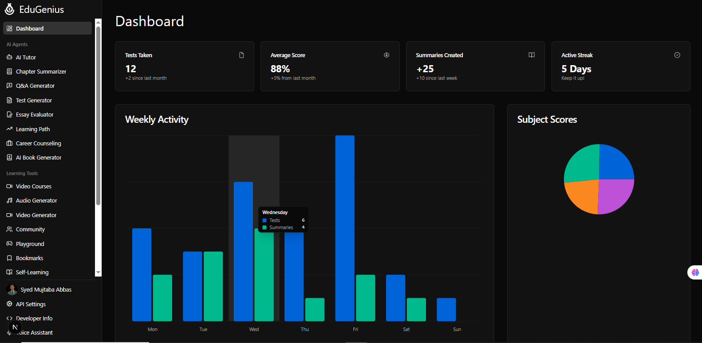

<div align="center">
  
  <h1 style="font-size: 3em; margin-bottom: 0; background: linear-gradient(45deg, #4F46E5, #7C3AED); -webkit-background-clip: text; -webkit-text-fill-color: transparent;">EduGenius</h1>
  <p style="font-size: 1.2em; margin-top: 0.5em; color: #4B5563;">🚀 Your AI-Powered Learning Co-Pilot</p>
  
  <p style="max-width: 800px; margin: 1.5em auto; line-height: 1.6; color: #374151;">
    A next-generation educational platform that leverages cutting-edge AI to provide personalized learning experiences, 
    interactive study tools, and comprehensive educational resources for students and educators worldwide. 
    Now featuring dark mode, PWA support, and enhanced accessibility.
  </p>

  <!-- Badges -->
  <div style="display: flex; gap: 10px; justify-content: center; flex-wrap: wrap; margin: 1.5em 0;">
    <a href="https://github.com/syed-mujtaba-stack/edugenius/blob/main/LICENSE.md">
      
    </a>
    <a href="https://github.com/syed-mujtaba-stack/edugenius/issues">
      
    </a>
    <a href="https://github.com/syed-mujtaba-stack/edugenius/stargazers">
      
    </a>
    <a href="https://nextjs.org/">
      
    </a>
    <a href="https://tailwindcss.com/">
      
    </a>
    <a href="https://www.typescriptlang.org/">
      
    </a>
  </div>
  
  <div style="margin: 2em 0; display: flex; gap: 15px; justify-content: center; flex-wrap: wrap;">
    <a href="https://mj-edugenius.vercel.app/" style="padding: 10px 20px; background: linear-gradient(45deg, #4F46E5, #7C3AED); color: white; border-radius: 8px; text-decoration: none; font-weight: 600; display: flex; align-items: center; gap: 8px;">
      <span>🚀</span> Live Demo
    </a>
    <a href="https://github.com/syed-mujtaba-stack/edugenius/issues/new?template=bug_report.md" style="padding: 10px 20px; background-color: #F3F4F6; color: #1F2937; border-radius: 8px; text-decoration: none; font-weight: 600; display: flex; align-items: center; gap: 8px;">
      <span>🐞</span> Report Bug
    </a>
    <a href="https://github.com/syed-mujtaba-stack/edugenius/issues/new?template=feature_request.md" style="padding: 10px 20px; background-color: #ECFDF5; color: #065F46; border-radius: 8px; text-decoration: none; font-weight: 600; display: flex; align-items: center; gap: 8px;">
      <span>✨</span> Request Feature
    </a>
  </div>
</div>

---

### 📋 Table of Contents
1. [About The Project](#-about-the-project)
2. [Screenshots](#-screenshots)
3. [Built With](#-built-with)
4. [Features](#-features)
5. [Roadmap](#-roadmap)
6. [Getting Started](#-getting-started)
7. [Deployment](#-deployment)
8. [Contributing](#-contributing)
9. [License](#-license)
10. [Contact](#-contact)
11. [Acknowledgements](#-acknowledgements)

---

### 📜 About The Project
<a id="-about-the-project"></a>

<div style="background-color: #F9FAFB; padding: 2rem; border-radius: 12px; margin: 1.5rem 0; border-left: 4px solid #4F46E5;">
  <p style="font-size: 1.1rem; line-height: 1.8; color: #1F2937; margin-bottom: 1.5rem;">
    EduGenius is a cutting-edge educational platform that revolutionizes learning through artificial intelligence. 
    Designed with students and educators in mind, it provides intelligent tools that adapt to individual learning styles, 
    making education more accessible, engaging, and effective for everyone.
  </p>
  
  <div style="display: flex; flex-wrap: wrap; gap: 1.5rem; margin: 1.5rem 0;">
    <div style="flex: 1; min-width: 250px; background: white; padding: 1.5rem; border-radius: 8px; box-shadow: 0 1px 3px rgba(0,0,0,0.1);">
      <h3 style="color: #4F46E5; margin-top: 0; display: flex; align-items: center; gap: 8px;">
        <span>🎯</span> Mission
      </h3>
      <p style="margin: 0.75rem 0 0; color: #4B5563;">
        To democratize education by making high-quality learning tools accessible to students worldwide, regardless of their location or background.
      </p>
    </div>
    
    <div style="flex: 1; min-width: 250px; background: white; padding: 1.5rem; border-radius: 8px; box-shadow: 0 1px 3px rgba(0,0,0,0.1);">
      <h3 style="color: #7C3AED; margin-top: 0; display: flex; align-items: center; gap: 8px;">
        <span>✨ Vision</span>
      </h3>
      <p style="margin: 0.75rem 0 0; color: #4B5563;">
        To create an intelligent learning ecosystem that adapts to each student's needs, making education more personalized and effective than ever before.
      </p>
    </div>
  </div>
  
  <div style="margin-top: 1.5rem; padding: 1rem; background: #EEF2FF; border-radius: 8px; display: flex; align-items: center; gap: 12px;">
    <div style="font-size: 1.5rem;">👨‍💻</div>
    <div>
      <p style="margin: 0; font-weight: 600; color: #1F2937;">Syed Mujtaba Abbas</p>
      <p style="margin: 0.25rem 0 0; color: #4B5563; font-size: 0.9rem;">
        Full-Stack Developer & Education Enthusiast
      </p>
      <div style="margin-top: 0.5rem; display: flex; gap: 8px;">
        <a href="https://github.com/syed-mujtaba-stack" style="color: #4F46E5; text-decoration: none; font-size: 0.9rem; display: inline-flex; align-items: center; gap: 4px;">
          <span>GitHub</span>→
        </a>
        <a href="https://instagram.com/m.j_syed" style="color: #4F46E5; text-decoration: none; font-size: 0.9rem; display: inline-flex; align-items: center; gap: 4px; margin-left: 12px;">
          <span>Instagram</span>→
        </a>
      </div>
    </div>
  </div>
</div>

<p align="right" style="margin-top: 2rem;">
  <a href="#top" style="display: inline-flex; align-items: center; gap: 4px; text-decoration: none; color: #4F46E5; font-weight: 500;">
    <span>Back to top</span>
    <span>↑</span>
  </a>
</p>

---

### 📸 Screenshots
<a id="-screenshots"></a>

<div align="center">
  
  <p><em>More screenshots coming soon!</em></p>
</div>

<p align="right">(<a href="#top">back to top</a>)</p>

---

### 🛠️ Built With
<a id="-built-with"></a>

This project is built with a modern tech stack that ensures performance, scalability, and a great user experience.

*   **[Next.js](https://nextjs.org/)**
*   **[React](https://reactjs.org/)**
*   **[Firebase](https://firebase.google.com/)**
*   **[Tailwind CSS](https://tailwindcss.com/)**
*   **[TypeScript](https://www.typescriptlang.org/)**
*   **[Google AI (Gemini)](https://ai.google.dev/)**

<p align="right">(<a href="#top">back to top</a>)</p>

---

### ✨ Features
<a id="-features"></a>

- **🌓 Dark/Light Mode** - Beautiful dark and light themes with system preference detection
- **📱 PWA Support** - Installable on any device for offline access
- **🤖 AI-Powered Learning** - Smart study tools powered by advanced AI
- **📊 Interactive Dashboards** - Track your learning progress in real-time
- **🔍 Smart Search** - Find resources and content instantly
- **📱 Responsive Design** - Works seamlessly on all devices
- **⚡ Fast Performance** - Built with Next.js 14 for optimal speed

<details>
  <summary><strong>🧠 Personalized Learning</strong></summary>
  <ul>
    <li><strong>AI Learning Paths:</strong> Custom study roadmaps based on learning goals.</li>
    <li><strong>Daily Study Routine:</strong> Consistent study habits with progress tracking.</li>
  </ul>
</details>

<details>
  <summary><strong>🛠️ AI-Powered Tools</strong></summary>
  <ul>
    <li><strong>AI Audio Generator:</strong> Text-to-speech for offline learning.</li>
    <li><strong>Career Counseling:</strong> AI-driven career path suggestions.</li>
    <li><strong>AI Essay Evaluator:</strong> Instant feedback on writing.</li>
    <li><strong>Chapter Summarizer & Q&A:</strong> Quick summaries and self-testing.</li>
    <li><strong>AI Test Generator:</strong> Custom tests with optional AI proctoring.</li>
  </ul>
</details>

<details>
  <summary><strong>💻 Developer-Focused Features</strong></summary>
  <ul>
    <li><strong>AI-Powered Code Generation:</strong> Code snippets in multiple languages.</li>
    <li><strong>Interactive Coding Exercises:</strong> Real-time feedback on coding problems.</li>
    <li><strong>Automated Code Debugging:</strong> AI-powered bug detection and fixes.</li>
  </ul>
</details>

<p align="right">(<a href="#top">back to top</a>)</p>

---

### 🛣️ Roadmap
<a id="-roadmap"></a>

See the [open issues](https://github.com/syed-mujtaba-stack/edugenius/issues) for a full list of proposed features and known issues.

- [ ] Teacher's AI Lesson Plan Generator
- [ ] AI Video Generator (Text-to-Video)
- [ ] Real-Time Quiz with Friends (Multiplayer)
- [ ] AI Voice Conversation Tutor
- [ ] Personalized Daily News Digest
- [ ] Gamified Learning Modules

<p align="right">(<a href="#top">back to top</a>)</p>

---

### 🏁 Getting Started
<a id="-getting-started"></a>

To get a local copy up and running, follow these simple steps.

#### Prerequisites
Ensure you have Node.js (v18 or later) and npm installed.
  ```sh
  npm install npm@latest -g
  ```

#### Installation
1.  **Clone the repository**
    ```sh
    git clone https://github.com/syed-mujtaba-stack/edugenius.git
    ```
2.  **Navigate to the project directory**
    ```sh
    cd edugenius
    ```
3.  **Install NPM packages**
    ```sh
    npm install
    ```
4.  **Set up environment variables**
    Create a `.env.local` file and add your Firebase and Google AI API keys.
    ```env
    NEXT_PUBLIC_FIREBASE_API_KEY=YOUR_KEY_HERE
    # ... and so on for all required keys
    ```
5.  **Run the development server**
    ```sh
    npm run dev
    ```
The application will be available at `http://localhost:9003`.

<p align="right">(<a href="#top">back to top</a>)</p>

---

### 🚀 Deployment
<a id="-deployment"></a>

The easiest way to deploy this Next.js app is to use the [Vercel Platform](https://vercel.com/new?utm_medium=default-template&filter=next.js&utm_source=create-next-app&utm_campaign=create-next-app-readme).

Check out the [Next.js deployment documentation](https://nextjs.org/docs/deployment) for more details.

<p align="right">(<a href="#top">back to top</a>)</p>

---

### 🤝 Contributing
<a id="-contributing"></a>

Contributions are what make the open-source community such an amazing place to learn, inspire, and create. Any contributions you make are **greatly appreciated**.

1.  Fork the Project
2.  Create your Feature Branch (`git checkout -b feature/AmazingFeature`)
3.  Commit your Changes (`git commit -m 'Add some AmazingFeature'`)
4.  Push to the Branch (`git push origin feature/AmazingFeature`)
5.  Open a Pull Request

<p align="right">(<a href="#top">back to top</a>)</p>

---

### 📄 License
<a id="-license"></a>

Distributed under the MIT License. See `LICENSE.md` for more information.

<p align="right">(<a href="#top">back to top</a>)</p>

---

### 📧 Contact
<a id="-contact"></a>

Syed Mujtaba Abbas - [@m.j_syed](https://instagram.com/m.j_syed) - abbasmujtaba125@gmail.com

Project Link: [https://github.com/syed-mujtaba-stack/edugenius](https://github.com/syed-mujtaba-stack/edugenius)

<p align="right">(<a href="#top">back to top</a>)</p>

---

### 🙏 Acknowledgements
<a id="-acknowledgements"></a>

*   [Shields.io](https://shields.io/)
*   [Next.js Documentation](https://nextjs.org/docs)
*   [Firebase Documentation](https://firebase.google.com/docs)
*   [Best-README-Template](https://github.com/othneildrew/Best-README-Template)

<p align="right">(<a href="#top">back to top</a>)</p>
