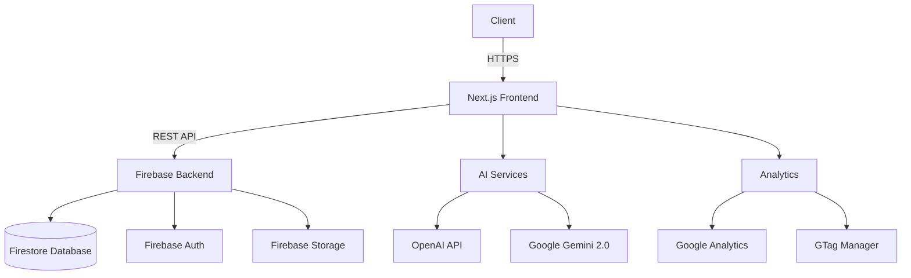

# **App Name**: EduGenius

## Core Features:

- AI Learning Assistant: AI Learning Assistant that summarizes chapters and generates Q&A for personalized learning.
- AI Test Generator: AI-Based Test Generator that dynamically creates tests and practice papers in real-time.
- Secure Authentication: User authentication via Clerk to maintain secure profiles and personalized dashboards.
- Progress Dashboards: Personalized user dashboards to visually track academic progress.
- Resource Download: Download AI-generated solved papers, notes, assignments and revisions sheets.
- Responsive UI: Responsive user interface built using Next.js and Tailwind CSS.

## Style Guidelines:

- Primary color: White (#FFFFFF) for a clean and modern learning environment.
- Background color: Black (#000000) to provide a high contrast and emphasize content.
- Accent color: Light Gray (#D3D3D3) to highlight key interactive elements.
- Body font: 'Helvetica Neue', a sans-serif font, to ensure readability.
- Headline font: 'Arial Black', a sans-serif font, to provide a bold and clear aesthetic to headlines.
- Simple and educational white icons on a black background to quickly convey the nature of each topic.
- Clean and structured layout with clear sections for learning modules, tests, and progress tracking, using a black and white color scheme.

## System Architecture

## Core Features

### AI-Powered Learning
- **Smart Learning Assistant**
  - Chapter summarization
  - Concept explanations
  - Interactive Q&A generation
  - Personalized study recommendations

### Assessment Tools
- **AI Test Generator**
  - Dynamic test paper creation
  - Customizable difficulty levels
  - Real-time question generation
  - Performance analytics

### User Management
- **Authentication & Authorization**
  - Email/password login
  - Social authentication (Google, GitHub)
  - Role-based access control
  - Secure session management

### Progress Tracking
- **Comprehensive Analytics**
  - Learning progress visualization
  - Performance metrics
  - Time tracking
  - Goal setting and achievement

### Content Management
- **Resource Library**
  - Study materials repository
  - AI-generated notes
  - Practice papers
  - Assignment solutions

## Design System

### Color Palette
| Role | Color | HEX |
|------|-------|-----|
| Primary | White | `#FFFFFF` |
| Background | Black | `#000000` |
| Accent | Light Gray | `#D3D3D3` |
| Success | Green | `#10B981` |
| Warning | Amber | `#F59E0B` |
| Error | Red | `#EF4444` |

### Typography
- **Headings**: 'Arial Black', sans-serif
- **Body**: 'Helvetica Neue', sans-serif
- **Code**: 'Fira Code', monospace

### UI Components
- **Buttons**: Rounded corners, subtle hover effects
- **Cards**: Clean white background with subtle shadow
- **Forms**: Minimalist design with clear validation
- **Navigation**: Sticky header with intuitive menu

## Technical Stack

### Frontend
- **Framework**: Next.js 15.5+
- **Language**: TypeScript 5.0+
- **Styling**: Tailwind CSS 3.3+
- **State Management**: Redux Toolkit
- **Form Handling**: React Hook Form
- **Data Fetching**: SWR

### Backend
- **Authentication**: Firebase Auth
- **Database**: Firestore
- **Storage**: Firebase Storage
- **Serverless Functions**: Firebase Cloud Functions

### AI & Analytics
- **AI Services**: OpenAI API, Google Gemini 2.0
- **Analytics**: Google Analytics 4
- **Tag Management**: Google Tag Manager

## Security & Compliance

- End-to-end encryption for sensitive data
- GDPR compliance
- Regular security audits
- Data retention policies
- Secure API endpoints

## Responsive Design

- Mobile-first approach
- Responsive breakpoints:
  - Mobile: < 640px
  - Tablet: 641px - 1024px
  - Desktop: > 1024px
- Touch-friendly interfaces
- Optimized for all screen sizes